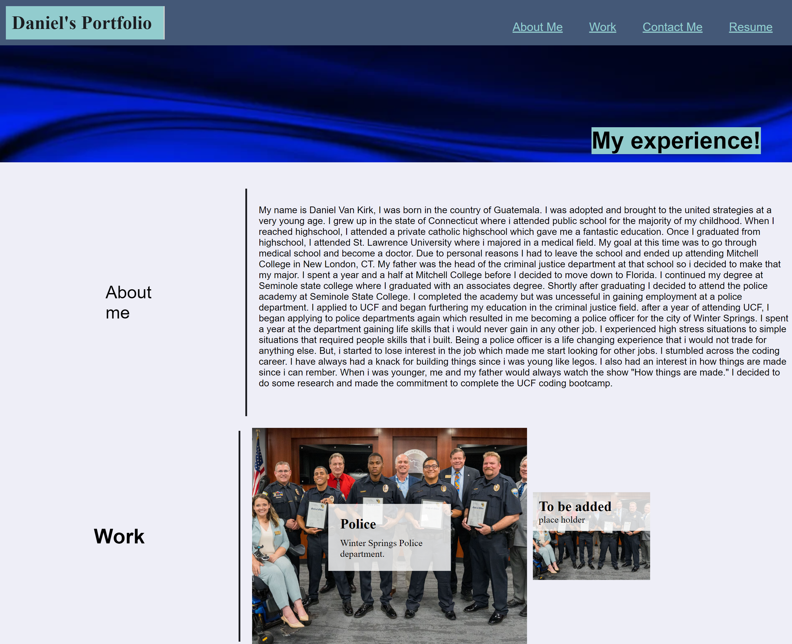

# Portfolio
## description
I created a portfolio describing my work experience and the work I completed in the boot camp. There is an about page that describes my 
back story. The portfolio is completely interactive and provides my information to contact me. 

## Content
This portfolio was built from the ground up. all code in the html and css was done by me to meet the acceptance criteria of this 
assignment. The HTML and CSS are properly applied to each other and are in working condition. Html semantics were used where needed to 
ease the reading of the code itself. 

## link
at this time GitHub is experiencing issues with deploying pages
## image

## resources
   police photo: https://scontent-atl3-2.xx.fbcdn.net/v/t39.30808-6/290910284_401889885316953_3011342773460603134_n.jpg?_nc_cat=111&ccb=1-      7&_nc_sid=730e14&_nc_ohc=JilxqV6YSYEAX8QobBu&_nc_ht=scontent-atl3-2.xx&oh=00_AfAz5IhZhI7CP6bYHRe3NUPci5lkHGgJTnk7ClYKT_kCKw&oe=64A1A33D

   banner photo: https://cdn.pixabay.com/photo/2015/11/10/08/31/banner-1036483_1280.jpg
